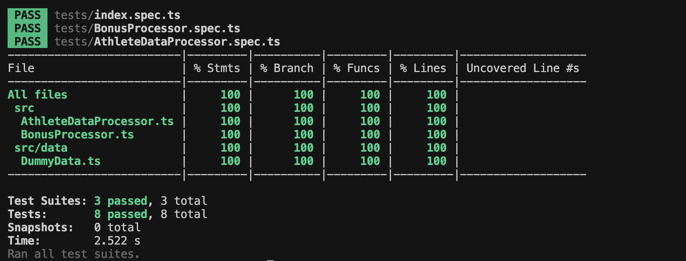

# Athlete Data Processor

## Overview

The **Athlete Data Processor** is a library designed to process data from professional athletes's sports computers. This library can load three types of input data summary, laps, and samples and consolidate them into a unified JSON format. The resulting data is suitable for further analysis by sports scientists and teams.

### Features

- Consolidates athlete data into a structured format.
- Processes heart rate samples, including handling null values and outlier detection.
- Interpolates and predicts future heart rate measurements.

### This is how the folder structure looks like:

```bash
┣ 📂public
 ┃ ┗ 📂images
 ┃ ┃ ┗ 📜test.png
 ┣ 📂src
 ┃ ┣ 📂data
 ┃ ┃ ┗ 📜DummyData.ts
 ┃ ┣ 📜AthleteDataProcessor.ts
 ┃ ┣ 📜BonusProcessor.ts
 ┃ ┣ 📜index.ts
 ┃ ┗ 📜interface.ts
 ┣ 📂tests
 ┃ ┣ 📜AthleteDataProcessor.spec.ts
 ┃ ┣ 📜BonusProcessor.spec.ts
 ┃ ┗ 📜index.spec.ts
 ┣ 📜.gitignore
 ┣ 📜Readme.md
 ┣ 📜jest.config.js
 ┣ 📜package-lock.json
 ┣ 📜package.json
 ┗ 📜tsconfig.json
```

## To run the project please check out this section

**[Instructions](#instructions)**

## Table of Contents

1. [Project Setup](#project-setup)
2. [Data Structures](#data-structures)
3. [Functionality](#functionality)
4. [Testing](#testing)
5. [Usage](#usage)
6. [Bonus Features](#bonus-features)
7. [License](#license)

## Table of Contents

1. [Project Setup](#project-setup)

## Project Setup

### Step 1: Initialize the Project

1. **Create a new project folder**, and initialize a Node.js project:
   ```bash
   npm init -y
   ```
2. Install Required Dependencies: Install TypeScript, Jest, and other necessary libraries:

```bash
npm install typescript jest ts-jest @types/jest --save-dev
```

3. Initialize TypeScript: Set up TypeScript by creating a tsconfig.json file:

```bash
npx tsc --init
```

- Edit **tsconfig.json** to ensure compatibility with Jest. Here's a minimal configuration:

```bash
{
  "compilerOptions": {
    "incremental": true,
    "strict": true,
    "esModuleInterop": true,
    "forceConsistentCasingInFileNames": true,
    "target": "es2016",
    "module": "commonjs",
    "rootDir": "./",
    "outDir": "./dist",
    "skipLibCheck": true,
    "sourceMap": true,
    "moduleResolution": "node",
    "allowSyntheticDefaultImports": true
  },
  "include": ["src/**/*", "tests/**/*"],
  "exclude": ["node_modules", "dist"]
}
```

4. Set Up Jest: Configure Jest by creating a jest.config.js file:

```bash
npx ts-jest config:init
```

## Data Structures

The library processes the following data structures:

```bash
export type Summary = {
  userId: string;
  activityId: number;
  activityName: string;
  durationInSeconds: number;
  startTimeInSeconds: number;
  startTimeOffsetInSeconds: number;
  activityType: string;
  averageHeartRateInBeatsPerMinute: number;
  activeKilocalories: number;
  deviceName: string;
  maxHeartRateInBeatsPerMinute: number;
};
```

Laps

```bash
export type Lap = {
  startTimeInSeconds: number;
  airTemperatureCelsius: number;
  heartRate: number;
  totalDistanceInMeters: number;
  timerDurationInSeconds: number;
};
```

Samples

```bash
export type Sample = {
  "recording-rate": number;
  "sample-type": string;
  data: string;
};
```

## Functionality

The main functionality of the library is provided by the processAthleteData function, which takes summary, laps, and samples as input and produces a consolidated JSON output.

Sample Usage

```bash
import { processAthleteData } from "./AthleteDataProcessor";
import { lapsData, sampleData, summaryData } from "./data/DummyData";

// Process and log the consolidated JSON output
const output = processAthleteData(summaryData, lapsData, sampleData);
console.log("Processed Output:", JSON.stringify(output, null, 2));
```

## Testing

To run the tests, use the following command:

```bash
npm test
OR
npm run test
```

Test Coverage

Ensure that your solution achieves at least 80% test coverage. You can check coverage by running:

```bash
npm test -- --coverage
OR
npm run test --coverage
```

## Bonus Features

- Pre-processing: Cleaning outliers by capping heart rate values to a normal range.
- Reverse Aggregation: Interpolating the median values to generate individual ticks from the aggregated values.
- Modeling: Predicting future heart rate values using simple linear regression.

### Instructions

To run the project please follow the below commands:

```bash
npm install
```

```bash
npm run start
OR
npm run dev
```

To run the test run below commands:

```bash
npm run test
OR
npm run test:coverage
OR
npm run test:watch
```



Note: In order to test the Bonus Solution please comment out this code here inside the [AthleteDataProcessor.ts](./src/AthleteDataProcessor.ts), also the bonus code does not cover all the test cases keeping the timeline and time in mind to kick of things.😊
